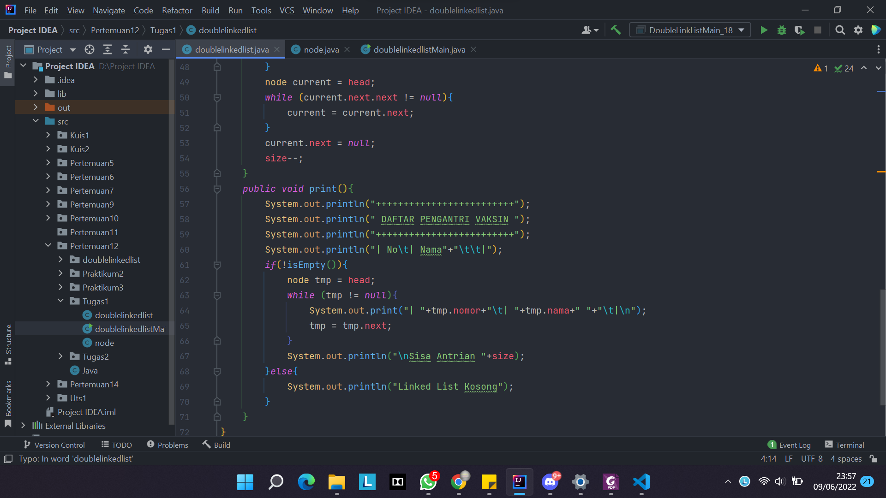
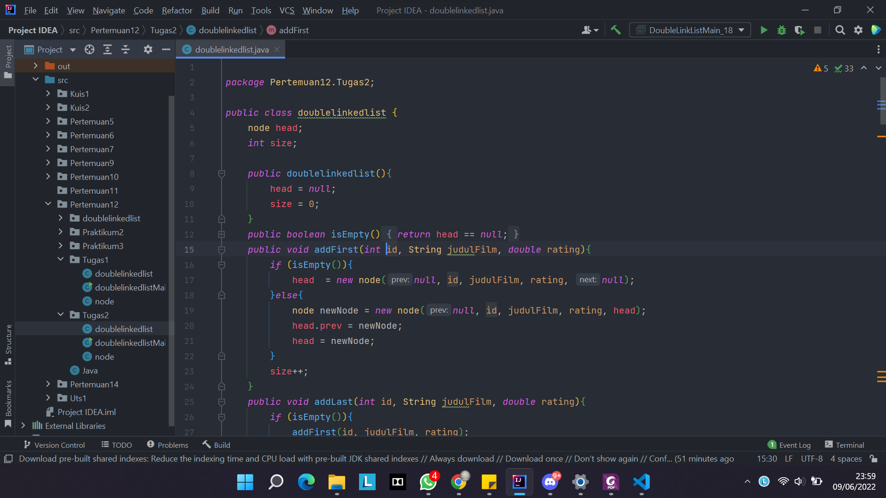

# **Laporan Praktikum**

>
Nama : Maulidio Farhan Rizkullah

>Kelas : 1G-TI | 18 | 2141720041

 

### **12.2.3 Pertanyaan Percobaan**
1. Jelaskan perbedaan antara single linked list dengan double linked lists!

    
    >- Single Linked List : memiliki satu buah pointer yaitu next

    >- Double Linked List : memiliki dua buah pointer yaitu pointer next dan prev.  

2. Perhatikan class Node, didalamnya terdapat atribut next dan prev. Untuk apakah atribut tersebut?

    
    >Pointer next menunjuk pada node setelahnya, dan pointer prev menunjuk pada node sebelumnya.

3. Perhatikan konstruktor pada class DoubleLinkedLists. Apa kegunaan inisialisasi atribut head dan size seperti pada gambar berikut ini?

    
    >potongan kode diatas berfungsi sebagai kondisi awal dari program tersebut, fungsi inisialisasi "head == null" untuk head belum menyimpan pada node, sedangkan fungsi inisialisasi "size = 0" untuk menyimpan jumlah data pada linked list

4. Pada method addFirst(), kenapa dalam pembuatan object dari konstruktor class Node prev dianggap sama dengan null?

    
    >karena pada method addFirst()diatas digunakan untuk menambah node pada awal atau index ke-0, dimana nantinya node yang dimasukkan tersebut prev nya bernilai null karena tidak merujuk atau menyimpan nilai dari node manapun

5. Perhatikan pada method addFirst(). Apakah arti statement head.prev = newNode ?

    
    >Potongan kode diatas berfungsi untuk pointer prev pada data yang sudah ada sebelumnya akan menyimpan / merujuk ke node yang baru

6. Perhatikan isi method addLast(), apa arti dari pembuatan object Node dengan mengisikan parameter prev dengan current, dan next dengan null?

    
    >karena pada method addLast() diatas digunakan untuk menambahkan node pada akhir atau index terakhir, dimana parameter prev dengan current digunakan untuk menyimpan node sebelumnya, dimana nantinya terjadi proses penambahan data pada index terakhir, sedangkan pada parameter next dengan null karena tidak merujuk pada node manapun karena sudah berada diakhir

 

### **12.3.3 Pertanyaan Percobaan**
1. Apakah maksud statement berikut pada method removeFirst()?Jelaskan!

    
    >Maksud dari potongan kode diatas adalah penghapusan pada index awal maka posisi head akan berpindah ke posisi node selanjutnya, dan pointer prev pada head akan bernilai null karena tidak menyimpan atau merujuk pada node manapun

2. Bagaimana cara mendeteksi posisi data ada pada bagian akhir pada method removeLast()?

    
    >dengan cara mencari posisi node yang pointer next nya bernilai null, jika sudah ditemukan maka bisa dipastikan node tersebut berada pada index terakhir

3. Jelaskan alasan potongan kode program di bawah ini tidak cocok untuk perintah remove!

    
    >potongan kode diatas tidak cocok untuk perintah remove, karena potongan kode tersebut cocok digunakan untuk removeFirst dimana tmp menyimpan data setelah head, selanjutnya head.next menyimpan data tmp.next. kemudian pointer prev pada tmp.next menunjuk ke head. maka dari itu dapat saya simpulkan penerapan potongan kode diatas tidak cocok untuk perintah remove

4. Jelaskan fungsi kode program berikut ini pada fungsi remove!

    
    >Fungsi Potongan Kode diatas adalah untuk merubah nilai yang tadinya ada pada current.prev.next atau pointer next pada node sebelumnya akan dipindah pada current.next

    sedangkan pada current.next.prev atau pointer pref pada node selanjutnya akan dipindah pada current.prev
 

### **12.4.3 Pertanyaan Percobaan**
1. Jelaskan method size() pada class DoubleLinkedLists!

    
    >methhod size() diatas berfungsi mereturn nilai menjadi 0 jika dalam kondisi tidak ada / kosong

2. Jelaskan cara mengatur indeks pada double linked lists supaya dapat dimulai dari indeks ke- 1!
    
    >dengan cara melakukan perulangan yang dimana diinisialisasikan dengan index sama dengan 1

3. Jelaskan perbedaan karakteristik fungsi Add pada Double Linked Lists dan Single Linked Lists!
    
    >- fungsi add pada double linked list hanya aada 1 fungsi  yang berdasarkan indeks sisanya dapat ditambah dari awal atau akhir indeks

    >- fungsi add pada single linked list terdapat 3 fungsi yaitu insertAfter, insertBefore, dan insertAt

4. Jelaskan perbedaan logika dari kedua kode program di bawah ini!

    
    >pada gambar a terdapat if else yang dimana jika size = 0 maka true sedangkan jika tidak maka false.

    >pada gambar b tidak menggunakan if else hanya langsung apakah head bernilai null jika benar maka kondisi nya adalah true

 

## **9.5 Tugas Praktikum**
1. 

2. 

