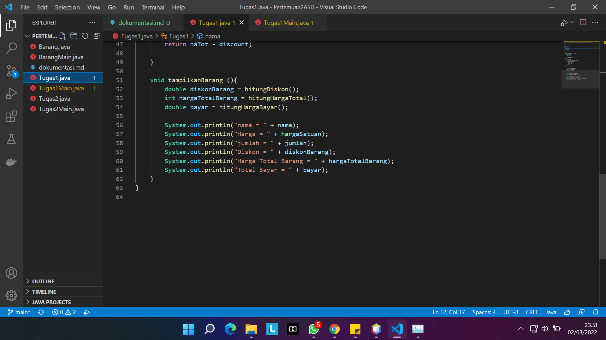

# **Dokumentasi Pertemuan 2**
## pertanyaan 2.2.3
    1. Karakteristik Class : Class merupakan suatu  rancangan yang tidak memiliki bentuk nyata dan atribut pada class bersifat umum dan tidak memiliki nilai spesifik.

    Karakteristik Object : Object merupakan bentuk nyata dari class dan atribut dari object bersifat spesifik dan memiliki nilai yang spesifik.

    2. kata kunci "class"

    3. Ada 4 yaitu namaBarang, jenisBarang, stok dan hargaSatuan yang berada di baris ke 13 dan 14.

    4. Ada 4 yaitu tampilBarang, tambahStok, kurangiStok dan hitungHargaTotal yang berada di baris ke 16,23,27 dan 31.

    5. 
        void kurangStok(int n) {
            if (stok > 0){
                stok = stok - n;
            } 
        }

    6. digunakan mengembalikan nilai n.

    7. Untuk mengembalikan nilai integer.

    8. tidak ada yang direturnkan.

## Pertanyaan 2.3.3
    1. Pada baris ke-15 dan nama objek yang dihasilkan adalah b1.

    2. Dengan mengetikkan nama objek yang telah di instansiasi lalu ketikan atribut atau method.

## Pertanyaan 2.4.3
    1. Baris 18

    2. Instansiasi konstruktor berparameter dengan nama objek baru b2

    3. 
        Barang b3 = new Barang("Vortex", "Mechanical Keyboard", 70, 600000);
        b3.tampilBarang();
        b3.kurangStok(50);

## Latihan Praktikum 2.5
1.  
    

2. 

