# Dokumentasi Pertemuan 3
### Maulidio Farhan Rizkullah
### 1G TI
### 18
### 2141720041

### **Pertanyaan 3.2**
1. Tidak, karena array of object hanya harus memliki atribut tidak harus selalu memiliki method.
2. Untuk membuat objek PersegiPanjang index array ke 1.
3. Mendeklarasikan array ppArray dengan jumlah array 3.
4. Kode tersebut adalah array kedua yang dilakukan input.
5. Untuk memudahkan mana class dan class main.

### **Pertanyaan 3.3**
1. Bisa
2.  
        segitiga[][] m = new segitiga[1][1];
        s[0][0] = new segitiga();
     
3. Belum ada objek pada index array 5. Seharusnya setelah baris 1 ada baris seperti berikut : 

    
        pgArray[5] = new Persegi();
    
4. 
        System.out.print("Masukkan panjang array : ");
        int arrLength = sc.nextInt();
        PersegiPanjang[] ppArray = new PersegiPanjang[arrLength];
    
5. Boleh, namun program tidak efisien.

### **Pertanyaan 3.4**
1. bisa
    
        public class Siswa{
            int jmlSiswa;
            public Siswa(){

            }
            public Siswa(int s) {
                jmlSiswa = s;
            }
        }
    
2.  
        public class Segitiga {
            public int alas;
            public int tinggi;

            public Segitiga(int a, int t){
                alas = a;
                tinggi = t;
            }
        }
    
3.  
        public class Segitiga {
            public int alas;
            public int tinggi;

            public Segitiga(int a, int t){
                alas = a;
                tinggi = t;
            }

            double hitungLuas(){
                return 0.5 * alas * tinggi;
            }

            int hitungKeliling(){
                return 3*alas;
            }
        }
    
4. 
        public class SegitigaMain {
            public static void main(String[] args) {
                Segitiga[] sgArray = new Segitiga[4];

                sgArray[0] = new Segitiga(10,4);
                sgArray[1] = new Segitiga(20,10);
                sgArray[2] = new Segitiga(15,6);
                sgArray[3] = new Segitiga(25,10);
            }
        }
        
    
5. 
        public class SegitigaMain {
            public static void main(String[] args) {
                Segitiga[] sgArray = new Segitiga[4];

                sgArray[0] = new Segitiga(10,4);
                sgArray[1] = new Segitiga(20,10);
                sgArray[2] = new Segitiga(15,6);
                sgArray[3] = new Segitiga(25,10);

                for (int i = 0; i < 4 ; i++){
                    System.out.println("Segitiga ke- " + i + "Luas : " + sgArray[i].hitungLuas() + " Keliling : " + sgArray[i].hitungKeliling());
                }
            }
        }

    
### **Latihan Praktikum 3.5**

1.  
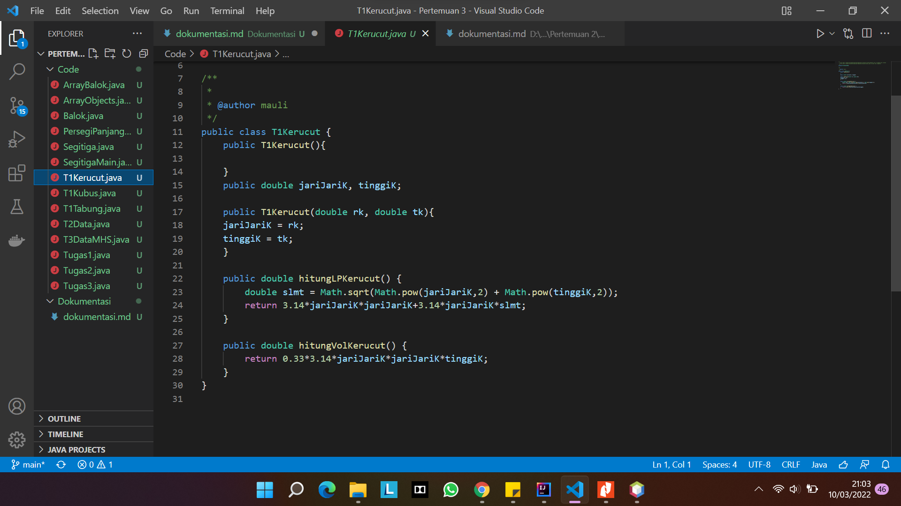
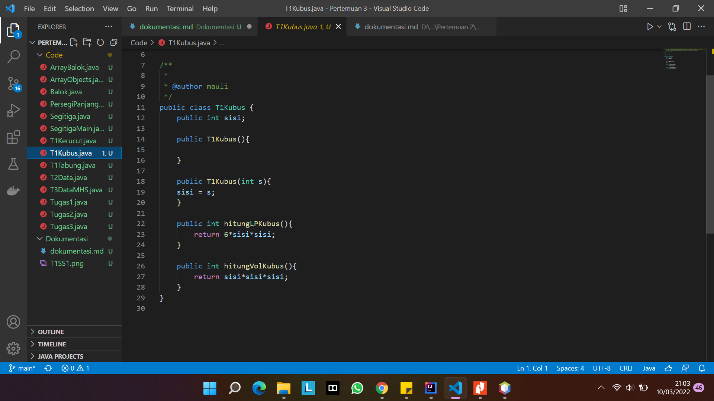
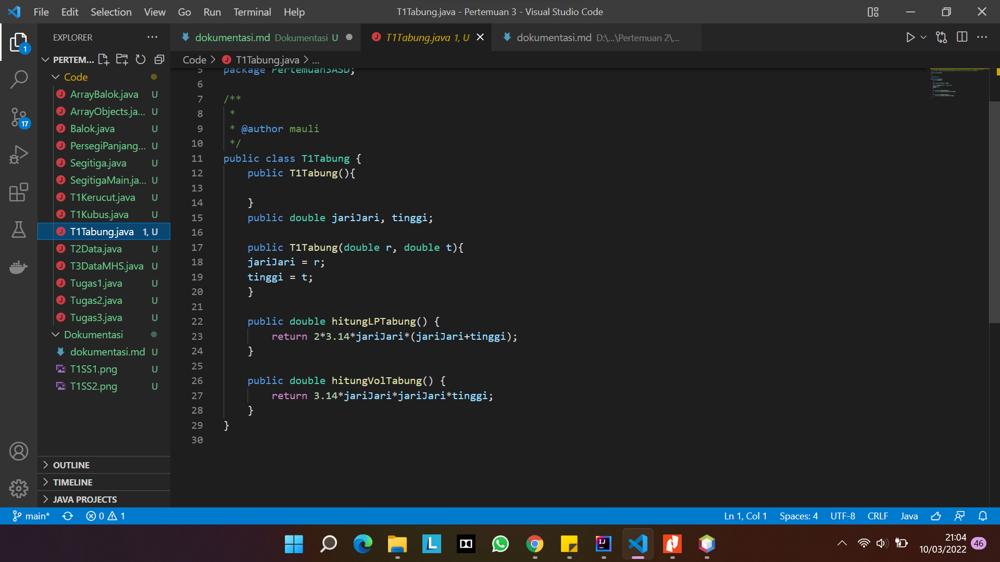
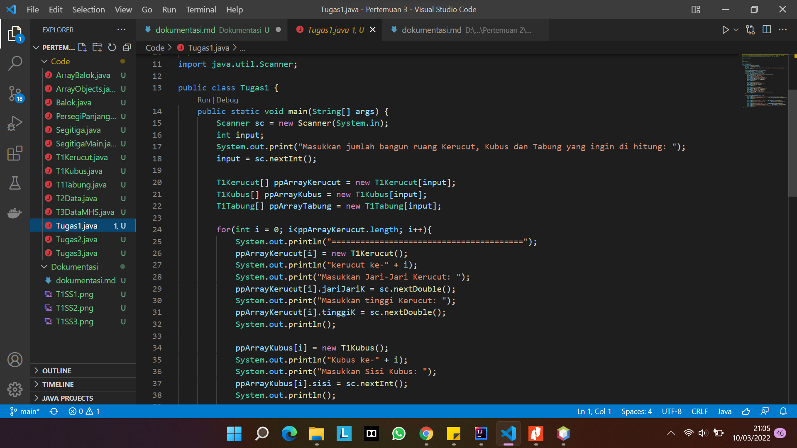
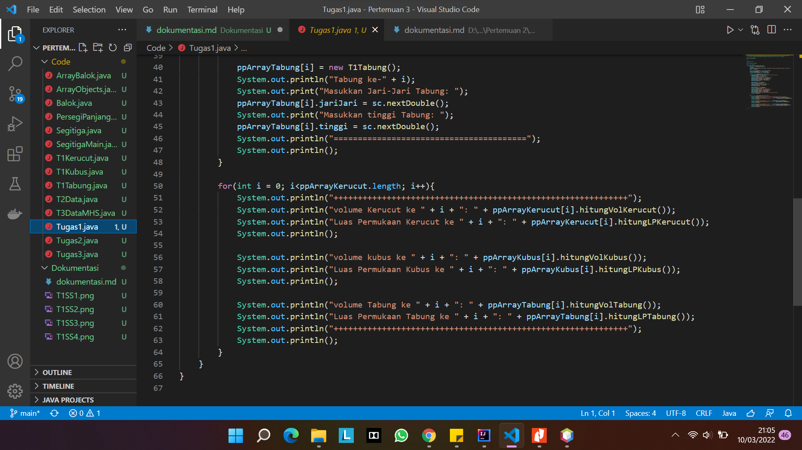
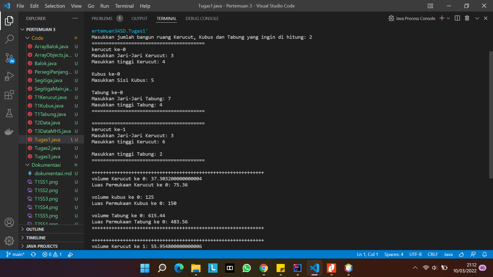
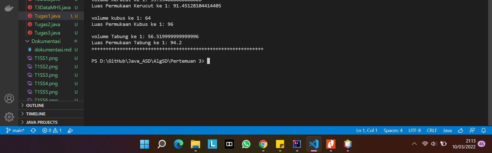

2. 
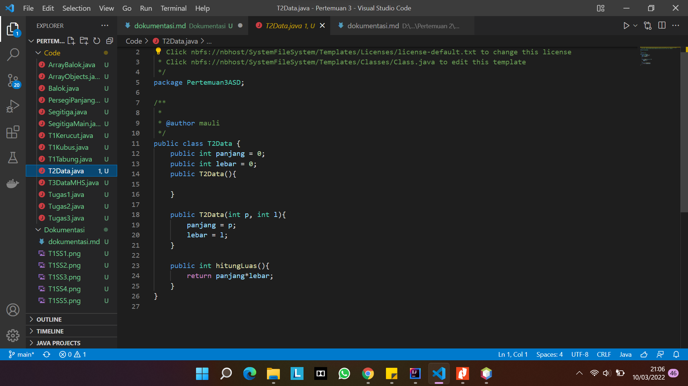
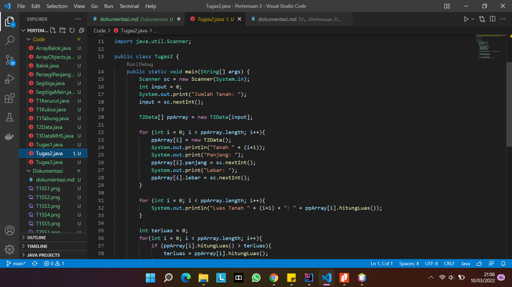
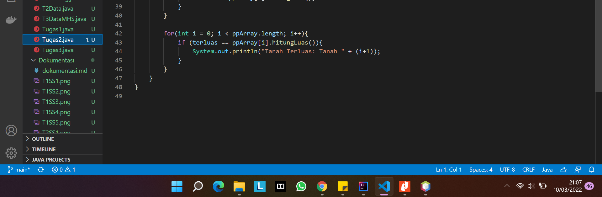
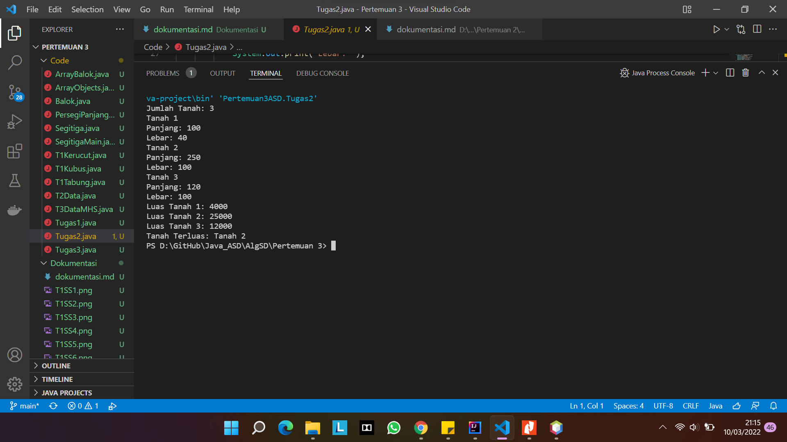

3. 
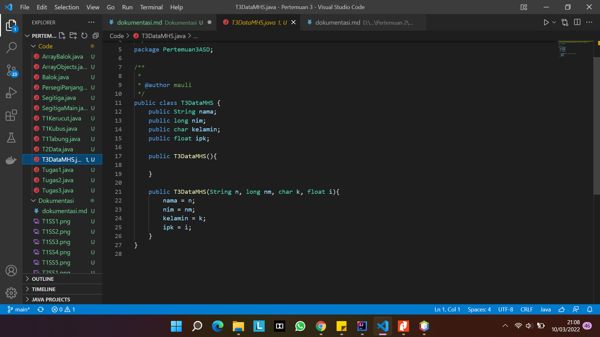
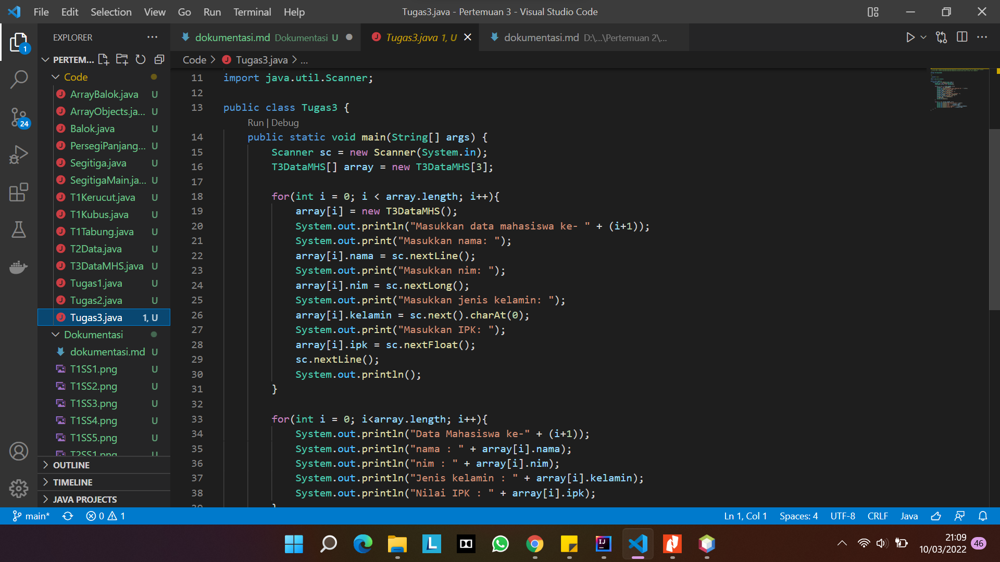
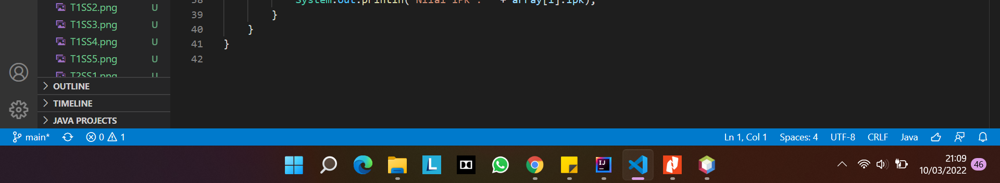
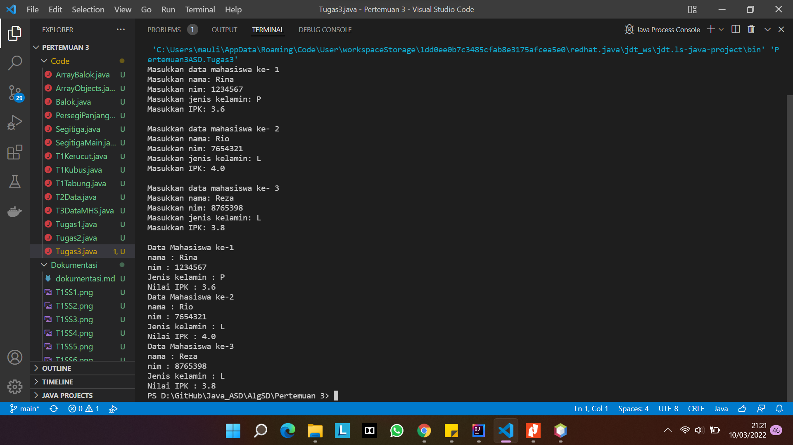
