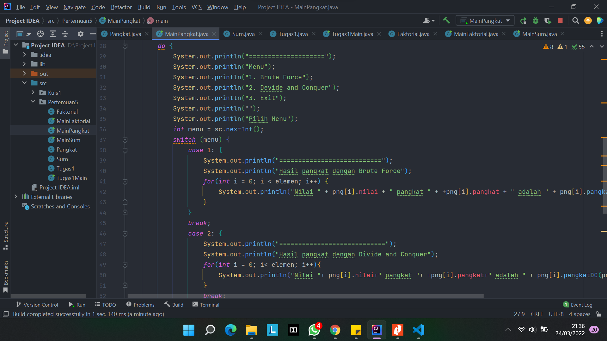

# **Dokumentasi Pertemuan 3**
### Maulidio Farhan Rizkullah
### 1G TI
### 18
### 2141720041

## **Pertanyaan 4.2.3**
1.	Karena jika nilai dari n sudah sama dengan 1, maka program akan me return kan 1, jika tidak maka nilai daripada variable n akan di kurang - 1,yang mana di setiap loop atau perulangan yang di lakukan pada method di kalikan dengan nilai sebelumnya dan kemudian program akan me return kan variable fakto.
   
2.	- Divide = faktorialDC(n-1) pengurangan pada   nilai n.
    - Conquer = n*.faktorialDC(n-1) penyelesaian dengan rekursif.
    - Combine = n*faktorialDC(n-1) pengombinasian dengan perkalian.

3.	Memungkinkan , perulangan pada method faktorialBF() dirubah selain menggunakan for dapat juga di rubah menjadi perulangan jenis while maupun do while.

4. 

5. Ada seperti Gambar dibawah ini
 
  
  
  ## **Pertanyaan 4.3.3**
1. Perbedaan dari method PangkatBF() dan PangkatDC yakni pada method pangkatBF() menggunakan fungsi iterative (fungsi yang melakukan perulangan yang melakukan proses perulangan terhadap sekelompok intruksi. Perulangan dilakukan dalam batasan syarat tertentu. Ketika syarat tersebut tidak terpenuhi lagi maka perulangan akan terhenti.). Seddangkan pada method pangkatDC() menggunakan fungsi rekursif yang mana pada fungsi ini perulangan yang terjadi akibat pengeksekusian suatu fungsi yang mana fungsi tersebut memanggil dirinya sendiri.
  
2.	Maksud dari potongan tersebut yakni apabila terdapat suatu bilangan ganjil maka program akan melakukan pembagian terhadap variuable n, yakni di bagi 2 kemudian dikalikan dengan method itu sendiri dan kemudian di kalikan lagi dengan variable a. namun apabila terdapat suatu bilangan genap maka program akan melakukan return/nilai balik dan di dalam return tersebut dilakukan pembagian terhadap variable n, yang mana variable n di bagi 2 dan kemudian di kalikan dengan method itu sendiri namun tidak dikalikan dengan nilai daripada variable a.
  
3.	Tahap combine sudah terjadi pada kode tersebut, dan lebih tepatnya tahapan tersebut di lakukan pada class Pangkat yang mana lebih tepatnya terletak pada method pangkatDC dan berada di baris kode ke 28, seperti pada gambar di bawah ini :

4. 

5. 
     

  ## **Pertanyaan 4.4.3**
1. -	Perbedaan perhitungan yang terjadi pada method TotalBF() yakni, kode program terkesan lebih ringkas dan sederhana, dan menjadikannya lebih mudah untuk di pahami kemudian menghasilkan algoritma yang standard untuk tugas tugas komputasi.
    - Perbedaan perhitungan yang terjadi pada method TotalDC() yakni, kode program lebih panjang daripada kode program pada method TotalBF(),namun method ini memiliki keuntungan yang mana pada method ini kita dapat memecahkan masalah atau case yang sulit kemudian juga memiliki efisiensi algoritma yang tinggi dan juga pada method ini memiliki sistemkerja parallel.

2. Dengan cara mengganti syntax println menjadi syntax printf dan juga teknik pembatasan karakter, caranya yakni dengan mengetikkan kode program: 

        System.out.printf("Total Keuntungan perusahaan selama  %d bulan adalah = %.2f \n",sm.elemen,sm.totalBF(sm.keuntungan));
 
 3.	Return value tersebut berguna untuk mengembalikan nilai dari variable lsum ,variable rsum dan juga arr [mid] yang mana masing-masing nya di jumlah kan terlebih dahulu.
 
 4.	Di butuhkan variable mid pada method TotalDC() yakni guna menampng nilai dari perhitungan (1+r)/2 yang mana nantinya akan gi gunakan sebagai pengisian nilai pada parameter di method TotalDC()
 
 5.	
 
 **Latihan Praktikum**
  1. 