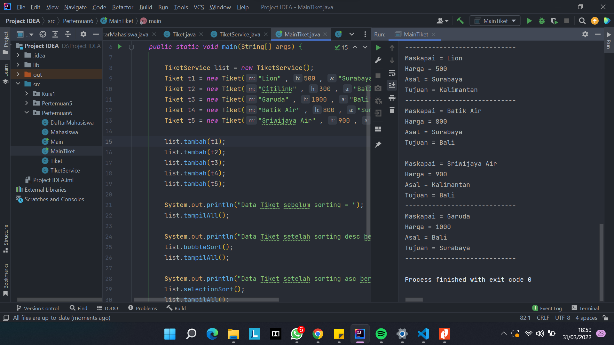

# **Dokumentasi Pertemuan 5**

### Maulidio Farhan Rizkullah
### 1G TI
### 18
### 2141720041

## **Pertanyaan 5.2.3**
1. Terdapat pada method void bubbleSort()
2. Terdapat pada method void selectionSort
3. Proses swap adalah proses untuk menukarkan nilai
4. untuk proses swap atau pertukaran. Nilai akan dibandingkan terlebih dahulu dengan indeks setelahnya apabila nilai lebih besar maka akan ditukar
5. 
    a. jika perulangan I digunakan untuk mengeloop array dan J untuk mengeloop array sesudah array I agar bisa di bandingkan 

    b. karena ada perulangan J yang mengeloop sampai listmhs, saat i = 0 maka akan di loop sampai array.length - 0  yang berarti di loop j pertama dari 1 sampai array.length

    c. karena untuk membandingkan dengan array i\

    d. 49 for dan 1225 tahapan

## **Pertanyaan 5.3.3**

1. untuk menyeleksi idxMin, jika listMhs[j] kurang dari listMhs[idxMin], maka idxMin sama dengan j, sehingga nilai idxMin dapat terseleksi/diubah dengan index terkecil dalam 1 cycle.

## **Latihan Praktikum**
1. 